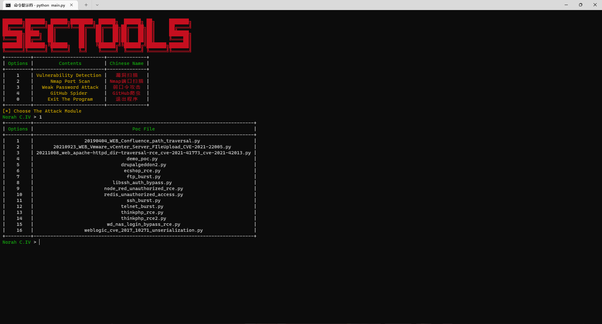
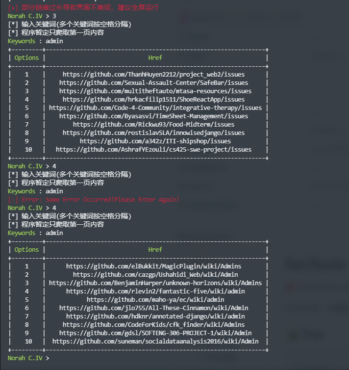

# SecTools
💞 Powered by Norah C.IV

(工作之余，无聊写写，不定期更新代码)
## 🎄Tree
```
.
├── begin
│   ├── get_file.py
│   └── start.py
├── function
│   ├── github.py
│   ├── passwdscan.py
│   ├── portscan.py
│   └── vulscan.py
├── .git
│   ├── branches
│   ├── config
│   ├── description
│   ├── HEAD
│   ├── hooks
│   │   ├── applypatch-msg.sample
│   │   ├── commit-msg.sample
│   │   ├── fsmonitor-watchman.sample
│   │   ├── post-update.sample
│   │   ├── pre-applypatch.sample
│   │   ├── pre-commit.sample
│   │   ├── pre-merge-commit.sample
│   │   ├── prepare-commit-msg.sample
│   │   ├── pre-push.sample
│   │   ├── pre-rebase.sample
│   │   ├── pre-receive.sample
│   │   ├── push-to-checkout.sample
│   │   └── update.sample
│   ├── index
│   ├── info
│   │   └── exclude
│   ├── logs
│   │   ├── HEAD
│   │   └── refs
│   │       ├── heads
│   │       │   └── master
│   │       └── remotes
│   │           └── origin
│   │               └── HEAD
│   ├── objects
│   │   ├── info
│   │   └── pack
│   │       ├── pack-2fc453f04f4e3ebafbd7cead074831277a6d9d9f.idx
│   │       └── pack-2fc453f04f4e3ebafbd7cead074831277a6d9d9f.pack
│   ├── packed-refs
│   └── refs
│       ├── heads
│       │   └── master
│       ├── remotes
│       │   └── origin
│       │       └── HEAD
│       └── tags
├── github
│   └── monitor.py
├── img
│   ├── github.png
│   ├── portscan.png
│   ├── start.png
│   ├── vulscan.png
│   └── weakpass.png
├── LICENSE
├── main.py
├── pocsuite3
│   ├── api
│   │   └── __init__.py
│   ├── cli.py
│   ├── console.py
│   ├── data
│   │   ├── dic_password_ftp.txt
│   │   ├── dic_password_imap_ssl.txt
│   │   ├── dic_password_imap.txt
│   │   ├── dic_password_memcached.txt
│   │   ├── dic_password_mongodb.txt
│   │   ├── dic_password_mysql.txt
│   │   ├── dic_password_oracle.txt
│   │   ├── dic_password_pop3.txt
│   │   ├── dic_password_postgresql.txt
│   │   ├── dic_password_rdp.txt
│   │   ├── dic_password_redis.txt
│   │   ├── dic_password_smb.txt
│   │   ├── dic_password_smtp.txt
│   │   ├── dic_password_sqlserver.txt
│   │   ├── dic_password_ssh.txt
│   │   ├── dic_password_svn.txt
│   │   ├── dic_password_telnet.txt
│   │   ├── dic_password_tomcat.txt
│   │   ├── dic_password_vnc.txt
│   │   ├── dic_password_weblogic.txt
│   │   ├── dic_username_ftp.txt
│   │   ├── dic_username_imap.txt
│   │   ├── dic_username_memcached.txt
│   │   ├── dic_username_mongodb.txt
│   │   ├── dic_username_mysql.txt
│   │   ├── dic_username_oracle.txt
│   │   ├── dic_username_pop3.txt
│   │   ├── dic_username_postgresql.txt
│   │   ├── dic_username_rdp.txt
│   │   ├── dic_username_redis.txt
│   │   ├── dic_username_smb.txt
│   │   ├── dic_username_smtp.txt
│   │   ├── dic_username_sqlserver.txt
│   │   ├── dic_username_ssh.txt
│   │   ├── dic_username_svn.txt
│   │   ├── dic_username_telnet.txt
│   │   ├── dic_username_tomcat.txt
│   │   ├── dic_username_vnc.txt
│   │   └── dic_username_weblogic.txt
│   ├── __init__.py
│   ├── lib
│   │   ├── controller
│   │   │   ├── controller.py
│   │   │   └── __init__.py
│   │   ├── core
│   │   │   ├── clear.py
│   │   │   ├── common.py
│   │   │   ├── convert.py
│   │   │   ├── data.py
│   │   │   ├── datatype.py
│   │   │   ├── decorators.py
│   │   │   ├── enums.py
│   │   │   ├── exception.py
│   │   │   ├── __init__.py
│   │   │   ├── interpreter_option.py
│   │   │   ├── interpreter.py
│   │   │   ├── log.py
│   │   │   ├── optiondict.py
│   │   │   ├── option.py
│   │   │   ├── plugin.py
│   │   │   ├── poc.py
│   │   │   ├── readlineng.py
│   │   │   ├── register.py
│   │   │   ├── revision.py
│   │   │   ├── settings.py
│   │   │   ├── shell.py
│   │   │   ├── statistics_comparison.py
│   │   │   ├── threads.py
│   │   │   └── update.py
│   │   ├── helper
│   │   │   ├── archieve
│   │   │   │   ├── __init__.py
│   │   │   │   ├── jar.py
│   │   │   │   ├── memoryzip.py
│   │   │   │   ├── war.py
│   │   │   │   └── zip.py
│   │   │   ├── __init__.py
│   │   │   └── java
│   │   │       ├── __init__.py
│   │   │       └── serialization.py
│   │   ├── __init__.py
│   │   ├── parse
│   │   │   ├── cmd.py
│   │   │   ├── configfile.py
│   │   │   ├── __init__.py
│   │   │   ├── rules.py
│   │   │   └── url.py
│   │   ├── request
│   │   │   ├── __init__.py
│   │   │   └── patch
│   │   │       ├── add_httpraw.py
│   │   │       ├── hook_request.py
│   │   │       ├── hook_request_redirect.py
│   │   │       ├── hook_urllib3_parse_url.py
│   │   │       ├── __init__.py
│   │   │       ├── remove_ssl_verify.py
│   │   │       ├── remove_warnings.py
│   │   │       └── unquote_request_uri.py
│   │   └── utils
│   │       ├── __init__.py
│   │       ├── markup.py
│   │       └── pcap_sniffer.py
│   ├── modules
│   │   ├── censys
│   │   │   └── __init__.py
│   │   ├── ceye
│   │   │   └── __init__.py
│   │   ├── fofa
│   │   │   └── __init__.py
│   │   ├── httpserver
│   │   │   └── __init__.py
│   │   ├── __init__.py
│   │   ├── interactsh
│   │   │   └── __init__.py
│   │   ├── listener
│   │   │   ├── bind_tcp.py
│   │   │   ├── __init__.py
│   │   │   └── reverse_tcp.py
│   │   ├── quake
│   │   │   └── __init__.py
│   │   ├── seebug
│   │   │   └── __init__.py
│   │   ├── shodan
│   │   │   └── __init__.py
│   │   ├── spider
│   │   │   └── __init__.py
│   │   └── zoomeye
│   │       └── __init__.py
│   ├── plugins
│   │   ├── file_record.py
│   │   ├── html_report.py
│   │   ├── __init__.py
│   │   ├── poc_from_pocs.py
│   │   ├── poc_from_redis.py
│   │   ├── poc_from_seebug.py
│   │   ├── target_from_censys.py
│   │   ├── target_from_cidr.py
│   │   ├── target_from_fofa.py
│   │   ├── target_from_quake.py
│   │   ├── target_from_redis.py
│   │   ├── target_from_shodan.py
│   │   └── target_from_zoomeye.py
│   ├── pocs
│   │   ├── 20190404_WEB_Confluence_path_traversal.py
│   │   ├── 20210923_WEB_Vmware_vCenter_Server_FIleUpload_CVE-2021-22005.py
│   │   ├── 20211008_web_apache-httpd_dir-traversal-rce_cve-2021-41773_cve-2021-42013.py
│   │   ├── demo_poc.py
│   │   ├── drupalgeddon2.py
│   │   ├── ecshop_rce.py
│   │   ├── ftp_burst.py
│   │   ├── __init__.py
│   │   ├── libssh_auth_bypass.py
│   │   ├── node_red_unauthorized_rce.py
│   │   ├── redis_unauthorized_access.py
│   │   ├── ssh_burst.py
│   │   ├── telnet_burst.py
│   │   ├── thinkphp_rce2.py
│   │   ├── thinkphp_rce.py
│   │   ├── wd_nas_login_bypass_rce.py
│   │   └── weblogic_cve_2017_10271_unserialization.py
│   └── shellcodes
│       ├── base.py
│       ├── data
│       │   ├── java
│       │   │   └── src
│       │   │       └── ReverseTCP
│       │   │           └── Payload.java
│       │   ├── linux
│       │   │   ├── bind_tcp.bin
│       │   │   ├── reverse_tcp.bin
│       │   │   ├── src
│       │   │   │   ├── bind_tcp.asm
│       │   │   │   └── reverse_tcp.asm
│       │   │   └── x64
│       │   │       ├── bind_tcp.bin
│       │   │       ├── reverse_tcp.bin
│       │   │       └── src
│       │   │           ├── bind_tcp.asm
│       │   │           └── reverse_tcp.asm
│       │   └── windows
│       │       ├── bind_tcp.bin
│       │       ├── reverse_tcp.bin
│       │       ├── src
│       │       │   ├── bind_tcp.asm
│       │       │   └── reverse_tcp.asm
│       │       └── x64
│       │           ├── bind_tcp.bin
│       │           ├── reverse_tcp.bin
│       │           └── src
│       │               ├── bind_tcp.asm
│       │               └── reverse_tcp.asm
│       ├── dotnet.py
│       ├── encoder.py
│       ├── generator.py
│       ├── __init__.py
│       ├── java.py
│       ├── php.py
│       └── python.py
├── port
│   └── scan.py
├── README.md
└── requirements.txt
```

## 🔥使用姿势
`python main.py`


## 🔥Function
### 漏洞扫描
(漏洞扫描暂时未开始写，没空，也没POC让我白嫖)

🤖 使用截图

### 端口扫描

🤖 使用截图


### 弱口令攻击
(目前差postgresql、vnc、ldap，别问为什么没写，问就是不会)

🤖 使用截图


### Github爬虫
(网络问题会频繁报错，未加代理，等我学习完使用系统代理再修改代码)

🤖 使用截图



# 参考项目
[pocsuite3](https://github.com/knownsec/pocsuite3)