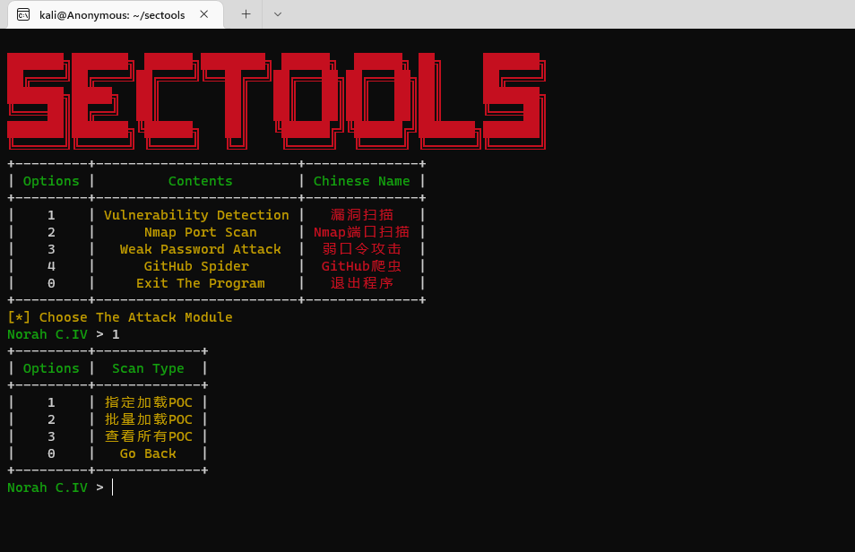
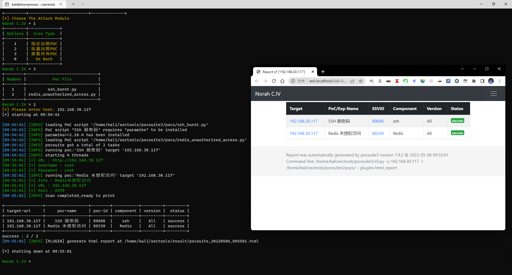
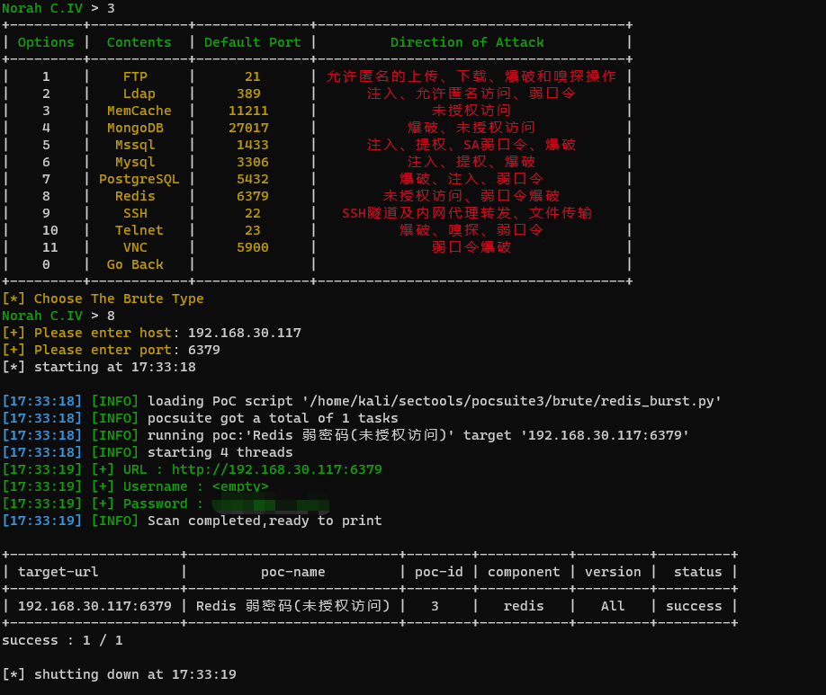
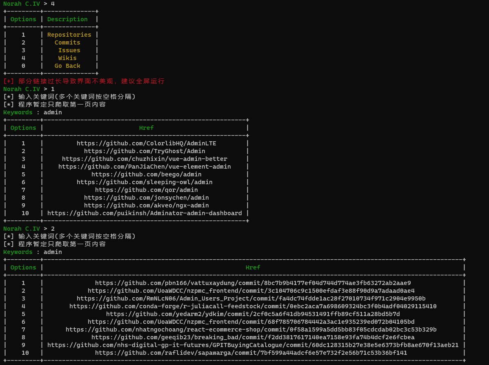

# SecTools
💞 Powered by Norah C.IV

## 🎄 Tree
```
.
├── LICENSE
├── main.py
├── pocsuite3
│   ├── api
│   │   └── __init__.py
│   ├── brute
│   │   ├── ftp_burst.py
│   │   ├── ldap_burst.py
│   │   ├── memcache_burst.py
│   │   ├── mongodb_burst.py
│   │   ├── mssql_burst.py
│   │   ├── mysql_burst.py
│   │   ├── postgresql_burst.py
│   │   ├── redis_burst.py
│   │   ├── ssh_burst.py
│   │   ├── telnet_burst.py
│   │   └── vnc_burst.py
│   ├── cli.py
│   ├── console.py
│   ├── data
│   │   ├── dic_password_ftp.txt
│   │   ├── dic_password_imap_ssl.txt
│   │   ├── dic_password_imap.txt
│   │   ├── dic_password_memcached.txt
│   │   ├── dic_password_mongodb.txt
│   │   ├── dic_password_mysql.txt
│   │   ├── dic_password_oracle.txt
│   │   ├── dic_password_pop3.txt
│   │   ├── dic_password_postgresql.txt
│   │   ├── dic_password_rdp.txt
│   │   ├── dic_password_redis.txt
│   │   ├── dic_password_smb.txt
│   │   ├── dic_password_smtp.txt
│   │   ├── dic_password_sqlserver.txt
│   │   ├── dic_password_ssh.txt
│   │   ├── dic_password_svn.txt
│   │   ├── dic_password_telnet.txt
│   │   ├── dic_password_tomcat.txt
│   │   ├── dic_password_vnc.txt
│   │   ├── dic_password_weblogic.txt
│   │   ├── dic_username_ftp.txt
│   │   ├── dic_username_imap.txt
│   │   ├── dic_username_memcached.txt
│   │   ├── dic_username_mongodb.txt
│   │   ├── dic_username_mysql.txt
│   │   ├── dic_username_oracle.txt
│   │   ├── dic_username_pop3.txt
│   │   ├── dic_username_postgresql.txt
│   │   ├── dic_username_rdp.txt
│   │   ├── dic_username_redis.txt
│   │   ├── dic_username_smb.txt
│   │   ├── dic_username_smtp.txt
│   │   ├── dic_username_sqlserver.txt
│   │   ├── dic_username_ssh.txt
│   │   ├── dic_username_svn.txt
│   │   ├── dic_username_telnet.txt
│   │   ├── dic_username_tomcat.txt
│   │   ├── dic_username_vnc.txt
│   │   └── dic_username_weblogic.txt
│   ├── __init__.py
│   ├── lib
│   │   ├── controller
│   │   │   ├── controller.py
│   │   │   └── __init__.py
│   │   ├── core
│   │   │   ├── clear.py
│   │   │   ├── common.py
│   │   │   ├── convert.py
│   │   │   ├── data.py
│   │   │   ├── datatype.py
│   │   │   ├── decorators.py
│   │   │   ├── enums.py
│   │   │   ├── exception.py
│   │   │   ├── __init__.py
│   │   │   ├── interpreter_option.py
│   │   │   ├── interpreter.py
│   │   │   ├── log.py
│   │   │   ├── optiondict.py
│   │   │   ├── option.py
│   │   │   ├── plugin.py
│   │   │   ├── poc.py
│   │   │   ├── readlineng.py
│   │   │   ├── register.py
│   │   │   ├── revision.py
│   │   │   ├── settings.py
│   │   │   ├── shell.py
│   │   │   ├── statistics_comparison.py
│   │   │   ├── threads.py
│   │   │   └── update.py
│   │   ├── helper
│   │   │   ├── archieve
│   │   │   │   ├── __init__.py
│   │   │   │   ├── jar.py
│   │   │   │   ├── memoryzip.py
│   │   │   │   ├── war.py
│   │   │   │   └── zip.py
│   │   │   ├── __init__.py
│   │   │   └── java
│   │   │       ├── __init__.py
│   │   │       └── serialization.py
│   │   ├── __init__.py
│   │   ├── parse
│   │   │   ├── cmd.py
│   │   │   ├── configfile.py
│   │   │   ├── __init__.py
│   │   │   ├── rules.py
│   │   │   └── url.py
│   │   ├── request
│   │   │   ├── __init__.py
│   │   │   └── patch
│   │   │       ├── add_httpraw.py
│   │   │       ├── hook_request.py
│   │   │       ├── hook_request_redirect.py
│   │   │       ├── hook_urllib3_parse_url.py
│   │   │       ├── __init__.py
│   │   │       ├── remove_ssl_verify.py
│   │   │       ├── remove_warnings.py
│   │   │       └── unquote_request_uri.py
│   │   └── utils
│   │       ├── __init__.py
│   │       ├── markup.py
│   │       └── pcap_sniffer.py
│   ├── modules
│   │   ├── censys
│   │   │   └── __init__.py
│   │   ├── ceye
│   │   │   └── __init__.py
│   │   ├── fofa
│   │   │   └── __init__.py
│   │   ├── httpserver
│   │   │   └── __init__.py
│   │   ├── __init__.py
│   │   ├── interactsh
│   │   │   └── __init__.py
│   │   ├── listener
│   │   │   ├── bind_tcp.py
│   │   │   ├── __init__.py
│   │   │   └── reverse_tcp.py
│   │   ├── quake
│   │   │   └── __init__.py
│   │   ├── seebug
│   │   │   └── __init__.py
│   │   ├── shodan
│   │   │   └── __init__.py
│   │   ├── spider
│   │   │   └── __init__.py
│   │   └── zoomeye
│   │       └── __init__.py
│   ├── plugins
│   │   ├── file_record.py
│   │   ├── html_report.py
│   │   ├── __init__.py
│   │   ├── poc_from_pocs.py
│   │   ├── poc_from_redis.py
│   │   ├── poc_from_seebug.py
│   │   ├── target_from_censys.py
│   │   ├── target_from_cidr.py
│   │   ├── target_from_fofa.py
│   │   ├── target_from_quake.py
│   │   ├── target_from_redis.py
│   │   ├── target_from_shodan.py
│   │   └── target_from_zoomeye.py
│   ├── pocs
│   │   ├── __init__.py
│   │   ├── jboss_cve_2015_7501_unserialization.py
│   │   ├── redis_unauthorized_access.py
│   │   ├── sunlogin_rce.py
│   │   └── zookeeper_unauthorized_access.py
│   └── shellcodes
│       ├── base.py
│       ├── data
│       │   ├── java
│       │   │   └── src
│       │   │       └── ReverseTCP
│       │   │           └── Payload.java
│       │   ├── linux
│       │   │   ├── bind_tcp.bin
│       │   │   ├── reverse_tcp.bin
│       │   │   ├── src
│       │   │   │   ├── bind_tcp.asm
│       │   │   │   └── reverse_tcp.asm
│       │   │   └── x64
│       │   │       ├── bind_tcp.bin
│       │   │       ├── reverse_tcp.bin
│       │   │       └── src
│       │   │           ├── bind_tcp.asm
│       │   │           └── reverse_tcp.asm
│       │   └── windows
│       │       ├── bind_tcp.bin
│       │       ├── reverse_tcp.bin
│       │       ├── src
│       │       │   ├── bind_tcp.asm
│       │       │   └── reverse_tcp.asm
│       │       └── x64
│       │           ├── bind_tcp.bin
│       │           ├── reverse_tcp.bin
│       │           └── src
│       │               ├── bind_tcp.asm
│       │               └── reverse_tcp.asm
│       ├── dotnet.py
│       ├── encoder.py
│       ├── generator.py
│       ├── __init__.py
│       ├── java.py
│       ├── php.py
│       └── python.py
├── README.md
├── requirements.txt
├── scan_func
│   ├── github.py
│   ├── passwdscan.py
│   ├── portscan.py
│   └── vulscan.py
├── scan_github
│   └── monitor.py
├── scan_port
│   └── scan.py
├── scan_result
│   └── __init__.py
├── scan_start
│   ├── format_table.py
│   ├── get_file.py
│   └── start.py
└── sec_img
    ├── github.png
    ├── port_scan.png
    ├── portscan.png
    ├── redis_scan.png
    ├── spider_2.jpg
    ├── spider.jpg
    ├── start.png
    ├── vulscan_1.png
    ├── vulscan_2.png
    ├── vulscan.png
    └── weakpass.png
```

## 🔥 使用姿势
`python main.py`


## 🔥 Function
### ✨ 漏洞扫描

🤖 使用截图



### ✨ 端口扫描
🤖 使用截图


### ✨ 弱口令攻击
(目前差postgresql、vnc、ldap，别问为什么没写，问就是不会)

🤖 使用截图


### ✨ Github爬虫
(网络问题会频繁报错，未加代理，等我学习完使用系统代理再修改代码)
🤖 使用截图



# 🌟 涉及项目
[pocsuite3](https://github.com/knownsec/pocsuite3)

[POC-bomber](https://github.com/tr0uble-mAker/POC-bomber)

# 🎄 TODO
(SecTools v2.0规划)
- POC分类，并加入批量扫描
- 优化写法，避免代码重复
- 增加子域探测、路径探测等常用功能
- 增加GitHub Code部分爬取
- 增加POC搜索功能