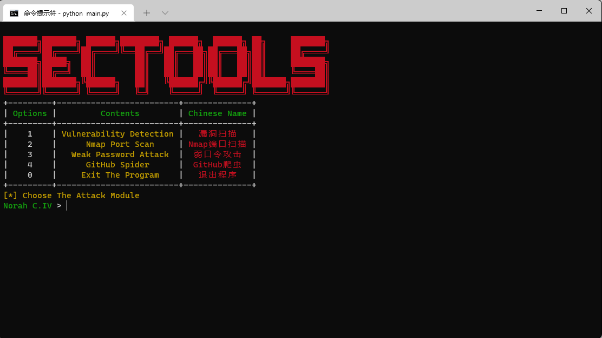
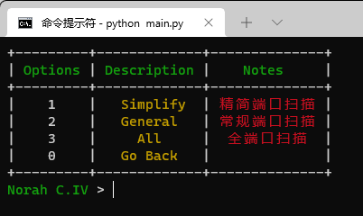
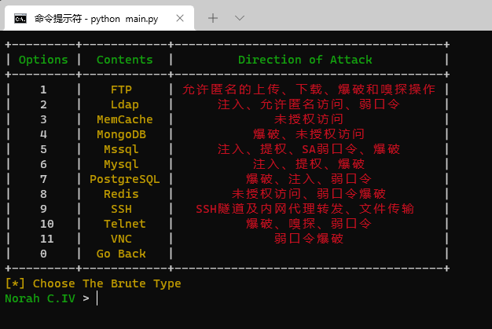
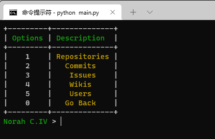

# SecTools
💞 Powered by Norah C.IV

## 🎄Tree
```
.
├── begin
│   └── start.py
├── function
│   ├── github.py
│   ├── passwdscan.py
│   ├── portscan.py
│   └── vulscan.py
├── github
│   └── monitor.py
├── img
│   ├── github.png
│   ├── portscan.png
│   ├── start.png
│   └── weakpass.png
├── main.py
├── pocs
│   └── tomcat.py
├── port
│   └── scan.py
├── README.md
├── requirements.txt
└── weakpass
    └── brute_ssh.py
  ```

## 🔥使用姿势
`python main.py`



## 🔥Function
### 漏洞扫描

### 端口扫描

### 弱口令攻击


### Github爬虫
